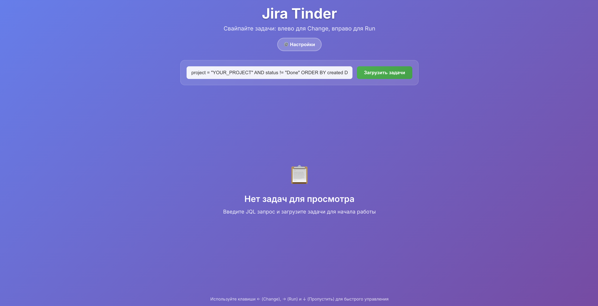

# Jira Tinder 🚀

> ⚠️ **Внимание!**  
> Проект сгенерирован с помощью Cursor




Интерфейс в стиле Tinder для работы с задачами Jira. Приложение позволяет быстро просматривать задачи и добавлять к ним лейблы "да" или "нет" простыми свайпами.

## ✨ Возможности

- 🎯 **Tinder-механика**: Свайпайте задачи влево или вправо
- 🔍 **JQL поддержка**: Гибкий поиск задач через JQL запросы
- 🏷️ **Автоматические лейблы**: Добавление лейблов "run" и "change" к задачам
- 👥 **Детальная информация**: Отображение Assignee, Reporter, компонентов и приоритета
- ⌨️ **Горячие клавиши**: Используйте стрелки ←, → и ↓ для быстрого управления
- 📱 **Адаптивный дизайн**: Работает на всех устройствах
- 🐳 **Docker поддержка**: Легкое развертывание в контейнерах

## 🚀 Быстрый старт

### Предварительные требования

- Node.js 18+ 
- npm или yarn
- Доступ к Jira API (v9.12+)

### Локальная установка

1. **Клонируйте репозиторий**
   ```bash
   git clone <repository-url>
   cd jira-tinder
   ```

2. **Установите зависимости**
   ```bash
   npm run install:all
   ```

3. **Настройте переменные окружения**
   ```bash
   cp env.example .env
   # Отредактируйте .env файл с вашими данными Jira
   ```

4. **Протестируйте подключение к Jira**
   ```bash
   node test-jira-connection.js
   ```

5. **Запустите приложение**
   ```bash
   # Вариант 1: Используйте скрипт
   ./start-dev.sh
   
   # Вариант 2: Запустите вручную
   # В одном терминале (backend)
   npm run dev
   
   # В другом терминале (frontend)
   cd client && npm start
   ```

6. **Откройте браузер**
   ```
   http://localhost:3000
   ```

## 🐳 Docker развертывание

### Простое развертывание

```bash
# Создайте .env файл с вашими данными
cp env.example .env

# Запустите приложение
docker-compose up -d

# Приложение будет доступно по адресу http://localhost:3001
```

### Продакшн развертывание

```bash
# Запустите с Nginx
docker-compose --profile production up -d

# Приложение будет доступно по адресу http://localhost
```

## ⚙️ Конфигурация

### Переменные окружения

| Переменная | Описание | Пример |
|------------|----------|---------|
| `JIRA_BASE_URL` | URL вашего Jira сервера | `http://jira.company.com` |
| `JIRA_USERNAME` | Имя пользователя Jira | `your_username` |
| `JIRA_PASSWORD` | Пароль пользователя Jira | `your_password` |
| `JIRA_API_TOKEN` | API токен Jira (альтернатива паролю) | `your_api_token` |
| `PORT` | Порт сервера | `3001` |

### Аутентификация

Приложение поддерживает два способа аутентификации в Jira:

1. **Логин/пароль**: Установите `JIRA_USERNAME` и `JIRA_PASSWORD`
2. **API токен**: Установите `JIRA_API_TOKEN` (рекомендуется для продакшна)

## 📖 Использование

### 1. Настройка JQL запроса

Введите JQL запрос для получения списка задач. Примеры:

```sql
-- Все открытые задачи в проекте
project = "PROJECT_KEY" AND status != "Done"

-- Задачи с высоким приоритетом
priority in (High, Highest) AND status != "Done"

-- Задачи за последнюю неделю
created >= -1w AND status != "Done"

-- Задачи определенного типа
issuetype = "Story" AND status != "Done"
```

### 2. Просмотр задач

После загрузки задач вы увидите карточки с информацией:
- **ID задачи** и тип
- **Название** и описание
- **Назначенный исполнитель** и создатель
- **Компоненты** и приоритет
- **Оценка времени**
- **Ссылка на Jira**

### 3. Свайп задач

- **Вправо (▶️)**: Добавляет лейбл "run"
- **Влево (🔄)**: Добавляет лейбл "change"
- **Пропустить (⏭️)**: Пропускает задачу без добавления лейбла
- **Клавиши**: Используйте ←, → и ↓ для быстрого управления

## 🏗️ Архитектура

```
jira-tinder/
├── server.js              # Express сервер
├── client/                # React приложение
│   ├── src/
│   │   ├── App.js        # Основной компонент
│   │   ├── App.css       # Стили
│   │   └── index.js      # Точка входа
│   └── public/            # Статические файлы
├── Dockerfile             # Docker образ
├── docker-compose.yml     # Docker Compose
└── package.json           # Зависимости
```

### API Endpoints

- `POST /api/tasks` - Получение задач по JQL
- `POST /api/tasks/:id/label` - Добавление лейбла к задаче
- `GET /api/tasks/:id` - Получение деталей задачи

## 🔧 Разработка

### Структура проекта

- **Backend**: Node.js + Express + Axios для Jira API
- **Frontend**: React + Framer Motion для анимаций
- **Стили**: CSS с градиентами и современным дизайном
- **Анимации**: Плавные переходы и свайп-эффекты

### Команды разработки

```bash
# Установка зависимостей
npm run install:all

# Запуск в режиме разработки
npm run dev

# Сборка клиента
npm run build:client

# Сборка для продакшна
npm run build
```

## 🚀 Развертывание

### Docker

```bash
# Сборка образа
docker build -t jira-tinder .

# Запуск контейнера
docker run -p 3001:3001 --env-file .env jira-tinder
```

### Docker Compose

```bash
# Запуск
docker-compose up -d

# Просмотр логов
docker-compose logs -f

# Остановка
docker-compose down
```

## 🔒 Безопасность

- Используйте API токены вместо паролей в продакшне
- Ограничьте доступ к приложению через firewall
- Регулярно обновляйте зависимости
- Используйте HTTPS в продакшне

## 🐛 Устранение неполадок

### ❌ Ошибка "Failed to fetch tasks from Jira"

**Причина**: Неправильная конфигурация подключения к Jira

**Решение**:
1. Проверьте `.env` файл - замените placeholder значения на реальные
2. Протестируйте подключение: `node test-jira-connection.js`
3. Убедитесь, что Jira сервер доступен и учетные данные корректны

**Подробная инструкция**: См. файл [SETUP.md](SETUP.md)

### Частые проблемы

1. **Ошибка подключения к Jira**
   - Проверьте URL и доступность Jira сервера
   - Убедитесь в правильности учетных данных
   - Используйте скрипт диагностики: `node test-jira-connection.js`

2. **Проблемы с CORS**
   - Проверьте настройки CORS в Jira
   - Убедитесь, что сервер запущен на правильном порту

3. **Ошибки API**
   - Проверьте права доступа пользователя в Jira
   - Убедитесь в корректности JQL запроса

### Диагностика

```bash
# Тест подключения к Jira
node test-jira-connection.js

# Проверка логов сервера
docker-compose logs jira-tinder

# Просмотр логов в реальном времени
docker-compose logs -f jira-tinder
```

## 📝 Лицензия

MIT License - см. файл LICENSE для деталей.

## 🤝 Вклад в проект

1. Форкните репозиторий
2. Создайте ветку для новой функции
3. Внесите изменения
4. Создайте Pull Request

## 📞 Поддержка

Если у вас есть вопросы или проблемы:
- Создайте Issue в GitHub
- Опишите проблему подробно
- Приложите логи и скриншоты

---

**Удачного использования Jira Tinder! 🎉**
